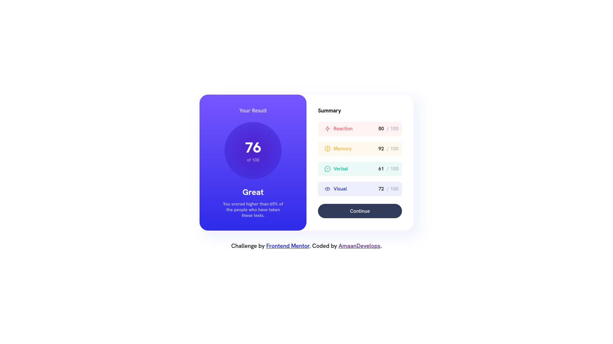

# Frontend Mentor - Results summary component solution

This is a solution to the [Results summary component challenge on Frontend Mentor](https://www.frontendmentor.io/challenges/results-summary-component-CE_K6s0maV). Frontend Mentor challenges help you improve your coding skills by building realistic projects. 

## Table of contents

- [Overview](#overview)
  - [The challenge](#the-challenge)
  - [Screenshot](#screenshot)
  - [Links](#links)
- [My process](#my-process)
  - [Built with](#built-with)
  - [What I learned](#what-i-learned)
  - [Continued development](#continued-development)
  - [Useful resources](#useful-resources)
- [Author](#author)

## Overview

### The challenge

Users should be able to:

- View the optimal layout for the interface depending on their device's screen size
- See hover and focus states for all interactive elements on the page

### Screenshot



### Links

- Solution URL: [Solution](https://www.frontendmentor.io/solutions/css-grids-flexbox-and-media-queries-all-for-responsive-layout-iOtqDNt2uG)
- Live Site URL: [live site](https://amaandevelops.github.io/frontEndMentor-result-summary-component/)

## My process

### Built with

- Semantic HTML5 markup
- CSS custom properties
- Flexbox
- CSS Grid
- Media Quries
- Mobile-first workflow


### What I learned

During the process of completing this coding challenge, I had the opportunity to dive deep into various aspects of front-end development. Here are the key learnings from my experience:

Flexbox Mastery: I gained extensive practice in utilizing Flexbox for layout design, enabling me to create flexible and responsive designs with ease.

Harnessing CSS Custom Properties: I learned how to leverage CSS custom properties (CSS variables) to centralize values and improve code efficiency and maintainability.

Exploring CSS Grid and Building Foundations: I developed a solid foundation in CSS Grid, enabling me to create grid-based layouts and organize designs more effectively.

Beginning Responsive Design Journey: I started my journey towards understanding and implementing responsive design principles, experimenting with media queries to adapt layouts to different devices.

Expanding Knowledge of CSS Selectors: I deepened my knowledge of advanced CSS selectors, allowing me to target elements precisely and apply styles efficiently.

```css

:root {
    font-size: 18px;
    --light-red: hsl(0, 100%, 67%);
    --orangey-yellow: hsl(39, 100%, 56%);
    --green-teal: hsl(166, 100%, 37%);
    --cobalt-blue: hsl(234, 85%, 45%);
    --light-slate-blue-bg: hsl(252, 100%, 67%);
    --light-royal-blue-bg: hsl(241, 81%, 54%);
    --violet-blue-circle: hsla(256, 72%, 46%, 1);
    --persian-blue-circle: hsla(241, 72%, 46%, 0);
    --white: hsl(0, 0%, 100%);
    --pale-blue: hsl(221, 100%, 96%);
    --light-lavender: hsl(241, 100%, 89%);
    --dark-gray-blue: hsl(224, 30%, 27%);
    
    --fs-t: 0.77rem;
    --fs-sm: 0.85rem;
    --fs-m:  0.925rem; 
    --fs-l:  1.425rem;
    --fs-xl: 2.5rem;
    
    --fw-r:  500;
    --fw-b:  700;
    --fw-bld: 800;
}


.result-card {
    display: grid;
    grid-template-columns: 1fr 1fr; 
}


@media (max-width: 740px) {
    :root {
        --fs-t: 0.77rem;
        --fs-sm: 0.85rem;
        --fs-m:  1.25rem; 
        --fs-l:  1.525rem;
        --fs-xl: 2.3rem;
    }
    
    main {
        justify-content: flex-start;
        align-items: stretch;
    }

    .result-card {
        height: 100vh;
        grid-template-columns: 1fr;
        grid-template-rows: 1fr 1.3fr;
    }

    .result-card-left {
        border-radius: 0 0 2rem 2rem;
    }

    .score-section {
        height: 6.544rem;
        width: 6.544rem;
    }

    .summary-item {
        margin: 0;
    }

    footer {
        text-align: center;
        font-size: 0.8rem;
        margin-top: 0;
        padding: 1rem;
    }
}

@media (max-width: 380px) {
    :root {
        --fs-t: 0.6rem;
        --fs-sm: 0.8rem;
        --fs-m:  1rem; 
        --fs-l:  1.2rem;
        --fs-xl: 2rem;
    }

    .score-section {
        height: 6.444rem;
        width: 6.444rem;
    }
    
    .comment-heading {
        margin-bottom: 0.4rem;
    }

    .continue-button {
        height: 2.3rem;
    }

    .summary-item {
        height: 2rem;
        padding: 0.7rem 0.6rem;
        margin: 0.3rem 0;
    }    
}

li:nth-child(1) {
    background-color: hsla(0, 100%, 67%, 0.08);
}

li:nth-child(2) {
    background-color: hsla(39, 100%, 56%, 0.08);
}

li:nth-child(3) {
    background-color: hsla(166, 100%, 37%, 0.08);
}

li:nth-child(4) {
    background-color: hsla(234, 85%, 45%, 0.08);
}

```

### Continued development

Completing this coding challenge has sparked my enthusiasm for continuous growth and improvement. Moving forward, I have identified the following areas to focus on:

Advancing CSS Grid skills: I will delve deeper into CSS Grid, exploring advanced features like grid auto-placement and nested grids to create more dynamic and responsive layouts.

Refining responsive design techniques: I plan to deepen my understanding of media queries and explore advanced responsive design patterns to ensure seamless experiences across devices.

Mastering CSS selectors: By expanding my knowledge of CSS selectors, including combinators and pseudo-elements, I aim to write more efficient and targeted stylesheets.

Enhancing layout design skills: I will invest time in studying modern layout techniques like Flexbox and CSS Grid, as well as exploring emerging frameworks and libraries.


### Useful resources

- [Resource 1](https://www.youtube.com/@WebDevSimplified) - I want to express my gratitude to Kyle from Web Dev Simplified for his invaluable tutorials on flexbox and CSS grids. His guidance helped me gain mastery in flexbox for layout design and explore CSS grids, allowing me to create flexible and organized designs.
- [Resource 2](https://www.youtube.com/@KevinPowell) - I would like to extend my gratitude to Kevin Powell for his tremendous help in improving my understanding of CSS. Through his tutorials, Kevin not only explained the "how" but also delved into the "why" behind CSS concepts. His guidance on conventions and writing high-quality CSS has been invaluable in my learning journey.

## Author
- Frontend Mentor - [@AmaanDevelops](https://www.frontendmentor.io/profile/amaandevelops)
- Twitter - [@AmaanDevelops](https://www.twitter.com/amaandevelops)
